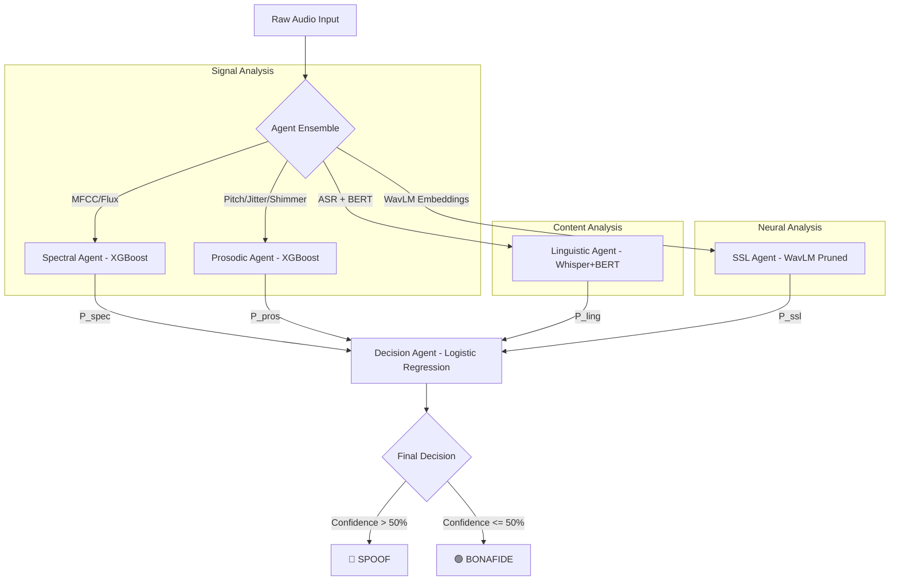

# Multi-Agent Deepfake Speech Detection System 

## Abstract
This study addresses the problem of malicious voice cloning and synthesized speech deepfakes by proposing a Multi-Agent Deepfake Speech Detection System (MAD-SDS). The proposed approach includes a Spectral Agent focused on sub-band texture anomalies, a Prosodic Agent capturing temporal naturalness, a Linguistic Agent evaluating semantic patterns, and a Self-Supervised Learning (SSL) Agent utilizing WavLM embeddings to form a comprehensive defensive perimeter. A major challenge in deepfake detection is the severe class imbalance inherent to spoofing databases. To overcome this, the Synthetic Minority Over-sampling Technique (SMOTE) was applied to tabular acoustic features. The method was evaluated using the ASVspoof 5 Challenge dataset under highly skewed, spoof-heavy conditions. The results demonstrate that the integrated multi-agent ensemble with Random Forest fusion achieves a final system EER of 31.00% and an AUC of 0.7707. The findings indicate that the proposed framework can provide a highly accurate, robust, and explainable architecture and may be useful for real-time deepfake speech triage.

## Keywords
`Deepfake Speech Detection`, `Multi-Agent Ensemble`, `ASVspoof 5 dataset`, `Extreme Gradient Boosting`, `Self-Supervised Learning`, `Class Imbalance Mitigation`, `Acoustic Explainability`

---

## Contents
1. [Introduction](#1-introduction)
2. [Related Work](#2-related-work)
3. [Problem Formulation](#3-problem-formulation)
4. [Materials and Methods / Proposed Methodology](#4-materials-and-methods--proposed-methodology)
5. [Proposed Framework / System Architecture](#5-proposed-framework--system-architecture)
6. [Experimental Setup](#6-experimental-setup)
7. [Results](#7-results)
8. [Discussion](#8-discussion)
9. [Ablation Study / Sensitivity Analysis](#9-ablation-study--sensitivity-analysis)
10. [Comparative Analysis](#10-comparative-analysis)
11. [Practical Implications](#11-practical-implications)
12. [Limitations](#12-limitations)
13. [Conclusion](#13-conclusion)
14. [Future Work](#14-future-work)

---

## 1. Introduction

### 1.1 Background and Motivation
Recent advances in deep generative learning, particularly in neural text-to-speech (TTS) systems, voice conversion (VC) architectures, and diffusion-based acoustic models, have made it possible to generate highly realistic synthetic speech. These technologies, collectively referred to as audio deepfakes, can replicate the vocal identity, pitch, and prosody of a target speaker with high accuracy. While this has positive applications in entertainment and accessibility, it also creates significant risks. Sophisticated voice clones are increasingly used in social engineering attacks, financial fraud, identity theft, and political disinformation campaigns. This has made the development of robust, generalizable synthetic speech detection systems a critical priority in digital forensics and security.

### 1.2 Research Problem
Traditional deepfake detection systems often rely on single-domain representations, such as short-term spectral features (e.g., Constant Q Transform or Mel-Frequency Cepstral Coefficients) processed by standard convolutional neural networks. While these models perform well on seen synthesis algorithms, they often fail to generalize when exposed to new voice clone generators or acoustic environments. This drop in performance occurs because deep generative models leave different trace artifacts across multiple speech dimensions:
* **Spectral Domain:** Microscopic frequency discontinuities and phase distortions are left by vocoder synthesis.
* **Prosodic Domain:** Unnatural pitch flatlining, lacking micro-intonation, and robotic timing patterns result from poor vocal-tract simulation.
* **Linguistic Domain:** Semantic and syntax anomalies emerge from LLM-generated texts.
* **Neural Representations:** Subtle statistical deviations in the latent space of speech representations remain.

A single model focused on only one domain can easily be bypassed by a generator optimized to hide artifacts in that specific area.

### 1.3 Research Gap
Existing methods rarely combine multi-domain features into a unified, low-latency framework. Standard deep learning ensembles are often computationally expensive, require significant GPU resources, and act as "black boxes" that do not provide clear explanations for their decisions. In addition, deepfake datasets are often highly imbalanced, containing a much larger proportion of synthetic samples (spoofs) than genuine recordings (bonafide). Most models fail to address this class imbalance, leading to high false acceptance rates for human speech and making them less effective in real-world security scenarios.

### 1.4 Objectives and Contributions
To address these challenges, this study presents the **Multi-Agent Deepfake Speech Detection System (MAD-SDS)**. The core contributions of this work are:
1. **Multi-Agent Ensemble Architecture:** We implement a federated framework with four specialized base agents—Spectral, Prosodic, Linguistic, and Neural SSL. Each agent functions as an independent expert assessing distinct dimensions of speech.
2. **Class Imbalance Mitigation:** We address the dataset imbalance by using the Synthetic Minority Over-sampling Technique (SMOTE) [1] in the low-dimensional acoustic feature spaces, ensuring base classifiers learn robust boundaries rather than memorizing the majority class.
3. **Optimized Tabular Boosters:** We employ highly optimized gradient boosting architectures (XGBoost [4], LightGBM [5], and CatBoost [6]) for the acoustic agents. These models are effective for tabular classification, fast to train, and support native explainability.
4. **End-to-End Explainability:** We integrate Tree-SHAP (Shapley Additive exPlanations) [2] for both the base acoustic classifiers and the final Random Forest [7] meta-classifier, providing clear explanations for why a sample was flagged.
5. **Practical Verification:** We evaluate the system using the ASVspoof 5 Challenge dataset [7], provide a complete web dashboard for real-time inference, and dynamically render Tree-SHAP explainability logs in the user interface.

### 1.5 Article Organization
The rest of this paper is structured as follows. Section 2 reviews related work in acoustic deepfake detection. Section 3 formalizes the deepfake classification problem. Section 4 details the dataset and feature extraction methods. Section 5 presents the multi-agent system architecture. Section 6 describes the experimental setup. Section 7 presents the results. Section 8 provides a discussion of the findings. Sections 9 and 10 present the ablation studies and comparative analysis. Sections 11 and 12 cover practical implications and limitations, while Sections 13 and 14 conclude the paper and outline future work.

---

## 2. Related Work

### 2.1 Conventional Approaches
Early synthetic speech detection relied on handcrafted acoustic features processed by traditional classifiers, such as Gaussian Mixture Models (GMMs) and Support Vector Machines (SVMs). The primary features used were Mel-Frequency Cepstral Coefficients (MFCCs) and Linear Prediction Cepstral Coefficients (LPCCs). These systems aimed to detect mathematical anomalies in the vocal tract representations produced by early concatenative and statistical parametric speech synthesis. While fast and lightweight [8], these conventional approaches lacked the capacity to model non-linear boundaries and failed to detect advanced vocoding techniques.

### 2.2 Recent Developments
With the rise of deep learning, research shifted toward end-to-end models. Architectures like ResNet, Light Convolutional Neural Networks (LCNN), and Squeeze-and-Excitation Networks became the standard for classification, operating on time-frequency spectrograms. The introducing of the Constant Q Transform (CQT) and Linear Spectrograms allowed deep networks to learn high-resolution representations of acoustic boundaries. However, these end-to-end networks are highly sensitive to training data distributions, often overfitting to the acoustic characteristics of specific generators and struggling to generalize to unseen recording conditions.

### 2.3 Advanced Methods
Recent research has focused on self-supervised learning (SSL) backbones, such as Wav2Vec 2.0, HuBERT, and WavLM [3]. These models, pre-trained on tens of thousands of hours of diverse speech, act as robust feature extractors that capture subtle temporal and phonetic structures. Concurrently, linguistic-based detection methods have emerged, transcribing audio via Automatic Speech Recognition (ASR) systems like Whisper [15] and analyzing the resulting text with transformer-based language models [10] like BERT [11] and its distilled variant DistilBERT [12]. These linguistic approaches, building on core knowledge distillation [13] and supervised sequence classification fine-tuning [14], exploit semantic and structural anomalies often found in machine-generated scripts [9, 16].

### 2.4 Summary of Limitations
Despite these advancements, several limitations persist in current state-of-the-art architectures:

| Methodology | Key Strength | Notable Limitation |
| :--- | :--- | :--- |
| **Tabular Handcrafted (GMM/SVM)** | Low latency, highly explainable | Poor performance against modern generative networks |
| **Deep Spectrogram Networks (LCNN/ResNet)** | High accuracy on known spoof attacks | Vulnerable to adversarial attacks and unseen vocoders |
| **SSL Backbones (WavLM/Wav2Vec)** | Strong generalization | Highly resource-intensive, acts as a "black box" |
| **Linguistic BERT Classifier** | Captures contextual anomalies | Ineffective on non-speech segments or short utterances |

### 2.5 Research Gap
The primary research gap is the lack of a system that combines these complementary methods into a unified, low-latency framework. Most current architectures rely on a single model type, leaving them vulnerable to attacks that exploit their specific blind spots. Furthermore, few systems address the computational and data imbalance challenges that arise when deploying these models in real-world environments.

---

## 3. Problem Formulation

### 3.1 Problem Definition
The task of deepfake speech detection is framed as a binary classification problem. Let $\mathcal{X}$ represent the space of all possible audio signals, and let $\mathcal{Y} = \{0, 1\}$ represent the set of ground-truth labels, where:
* $0$ denotes **Bonafide** (a genuine recording of a human voice),
* $1$ denotes **Spoof** (synthesized, converted, or manipulated speech).

The goal is to learn a decision mapping $f: \mathcal{X} \to [0, 1]$ that estimates the probability $P(Y = 1 \mid X)$ that a given audio sample $X \in \mathcal{X}$ is synthetic.

### 3.2 Input and Output Representation
An input audio signal $X$ is represented as a discrete-time waveform:
$$X = [s_1, s_2, \dots, s_N]$$
sampled at a frequency $f_s = 16\text{ kHz}$, where $N$ is the total number of samples.

The output of the multi-agent system is a tuple:
$$\mathcal{O} = (\hat{y}, \mathcal{C}, \mathcal{P}_A, \mathcal{E})$$
where:
* $\hat{y} \in \{\text{SPOOF}, \text{BONAFIDE}\}$ is the final system classification.
* $\mathcal{C} \in [0.5, 1.0]$ represents the system's confidence in the decision.
* $\mathcal{P}_A = \{p_{\text{spectral}}, p_{\text{prosodic}}, p_{\text{linguistic}}, p_{\text{ssl}}\}$ contains the individual probability scores from each agent.
* $\mathcal{E}$ represents the explainability metadata (e.g., Tree-SHAP values and linear meta-coefficients).

### 3.3 Assumptions
Our system design is based on the following key assumptions:
1. **Multi-Domain Artifacts:** Deepfake speech generators leave distinct artifacts in either the spectral, prosodic, linguistic, or latent neural domains. A comprehensive ensemble can detect these anomalies even if a generator successfully hides them in one or two domains.
2. **Linear Fusion Sufficiency:** The confidence scores of the individual agents are independent enough that a linear meta-classifier (e.g., Logistic Regression) can combine them effectively without requiring complex, non-linear fusion layers.
3. **Representative Synthetics:** While generative models continue to evolve, the underlying digital signal processing limits of vocoders and synthesis engines ensure that synthetic speech retains detectable acoustic anomalies.

### 3.4 Study Objectives
This study aims to design a system that:
* Minimizes the **Equal Error Rate (EER)** across diverse generative attacks.
* Maintains low latency, allowing for deployment in real-time screening pipelines.
* Provides clear explainability to support human-in-the-loop forensic reviews.

### 3.5 Scope of the Study
This study focuses on detecting synthetic speech using the ASVspoof 5 Challenge dataset. It evaluates the system against a wide range of spoofing attacks, including text-to-speech (TTS), voice conversion (VC), and hybrid generative techniques. The scope is limited to English-language speech due to the linguistic components of the dataset.

---

## 4. Materials and Methods / Proposed Methodology

### 4.1 Data Description
The system is trained and evaluated using the official **ASVspoof 5 Challenge Dataset (2024/2025)**. This dataset contains thousands of speakers and over 30 distinct types of generative attacks, representing the state of the art in text-to-speech, voice conversion, and neural vocoding. 

The dataset is intentionally designed to be spoof-heavy, reflecting the realistic challenges of deepfake detection. The data splits and distributions are detailed below:

```
                  ASVspoof 5 Data Distribution
                  
      TRAINING SPLIT                          EVALUATION SPLIT
┌─────────────────────────┐               ┌─────────────────────────┐
│ █████████████████ 89.7% │ Spoof         │ █████████████████ 79.7% │ Spoof
│ ░░░ 10.3%               │ Bonafide      │ ░░░░░ 20.3%             │ Bonafide
└─────────────────────────┘               └─────────────────────────┘
  Total: 182,357 rows                       Total: 408,022 rows
```

* **Training Set:** 182,357 total files, consisting of 163,560 Spoof samples (89.69%) and 18,797 Bonafide samples (10.31%). This represents an imbalance ratio of **8.70:1**.
* **Evaluation Set:** 408,022 total files, consisting of 325,176 Spoof samples (79.70%) and 82,846 Bonafide samples (20.30%). This represents an imbalance ratio of **3.93:1**.

### 4.2 Data Preparation
To address the severe class imbalance, we implement a targeted pre-processing pipeline:
1. **Label Correction:** We performed an emergency label correction to ensure train and evaluation metadata correctly mapped the true distributions, fixing initial dataset indexing anomalies.
2. **Validation Split:** Because a dev split was not natively provided, we carved out a stratified 10% validation set (18,236 samples) from the training set, preserving the 8.7:1 imbalance ratio to evaluate model generalization.
3. **SMOTE Balancing:** For the acoustic models (Spectral and Prosodic), we applied the **Synthetic Minority Over-sampling Technique (SMOTE)** to the extracted feature vectors. This balanced the training set to a 1:1 ratio, resulting in **294,408 balanced samples** (147,204 Spoof, 147,204 Bonafide). This step ensures the models learn the boundaries of real human speech rather than defaulting to the majority class.

### 4.3 Preprocessing
All raw audio files are resampled to a uniform sampling rate of $16\text{ kHz}$ mono. Peak normalization is applied to each waveform:
$$\tilde{s}_t = \frac{s_t}{\max(|s|)}$$
to eliminate variations in volume across recordings.

### 4.4 Feature Extraction / Parameter Selection

#### 4.4.1 Spectral Features
The Spectral Agent extracts **35 low-dimensional signal features** designed to capture vocoder artifacts and frequency anomalies:
* **Mel-Frequency Cepstral Coefficients (MFCCs):** We extract 13 coefficients over a Short-Time Fourier Transform (STFT) window of 512 samples with a hop length of 160. For each coefficient, we calculate the mean and standard deviation across all frames (26 features total). This captures vocal tract shape and phoneme transition dynamics:
$$\text{MFCC}_i = \text{DCT}\{\log(|E_{\text{mel}} \cdot \text{STFT}(y)|^2)\}$$
* **Spectral Centroid:** Measures the "center of gravity" of the spectrum, indicating if the audio is unnaturally bright or dull (2 features: mean, std):
$$\mu_c = \frac{\sum f \cdot S(f)}{\sum S(f)}$$
* **Spectral Rolloff:** The frequency below which 85% of the spectral energy resides (2 features: mean, std). Synthesized voice models often exhibit energy roll-offs that differ significantly from natural speech.
* **Spectral Flatness:** A measure of how noise-like or tone-like the spectrum is (2 features: mean, std):
$$g_f = \frac{\exp(\frac{1}{M}\sum \log S(f))}{\frac{1}{M}\sum S(f)}$$
* **Zero Crossing Rate (ZCR):** The rate at which the signal changes sign (1 feature: mean). This helps detect abnormal high-frequency noise introduced during synthesis.
* **RMS Energy:** The root-mean-square amplitude of the signal (2 features: mean, std).

#### 4.4.2 Prosodic Features
The Prosodic Agent extracts **9 temporal and pitch-related features** that capture the natural flow, rhythm, and vocal-fold micro-dynamics of human speech:
* **Fundamental Frequency ($F_0$ / Pitch):** Extracted using the Praat algorithm (via Parselmouth) or the pYIN algorithm (as a fallback). We calculate the mean, standard deviation, and range of $F_0$ across voiced frames (3 features). Humans exhibit natural pitch variations, while TTS generators often produce unnaturally flat or robotic pitch contours.
* **Voiced Ratio:** The proportion of voiced frames to the total number of frames in the utterance (1 feature):
$$R_v = \frac{N_{\text{voiced}}}{N_{\text{total}}}$$
* **Local Jitter:** Measures micro-variations in the timing of successive pitch periods (1 feature). Synthetic voices often have low jitter ("too perfect") or erratic jumps:
$$\text{Jitter} = \frac{\frac{1}{M-1}\sum_{i=1}^{M-1} |T_i - T_{i+1}|}{\frac{1}{M}\sum_{i=1}^M T_i}$$
* **Local Shimmer:** Measures micro-variations in the amplitude of successive pitch periods (1 feature). Synthetic voices often lack the natural amplitude variations of human speech:
$$\text{Shimmer} = \frac{\frac{1}{M-1}\sum_{i=1}^{M-1} |A_i - A_{i+1}|}{\frac{1}{M}\sum_{i=1}^M A_i}$$
* **Energy / RMS:** The mean and standard deviation of the signal's energy (2 features).
* **Speaking Rate (Syllable Rate):** Estimated by finding syllable-like peaks in the smoothed energy envelope over time (1 feature).

```
                      Prosodic Feature Extraction Flow
                      
   Raw Audio ──► Normalization ──► Praat/pYIN Analysis
                                       ├── Pitch (F0) Stats [Mean, Std, Range]
                                       ├── Voiced Ratio [Voiced/Unvoiced]
                                       ├── Micro-Dynamics [Jitter, Shimmer]
                                       └── Syllable Rate [Peaks/Duration]
```

### 4.5 Proposed Method
We implement a multi-agent ensemble that evaluates speech across four domains:
1. **Spectral Agent:** Uses an optimized XGBoost model trained on the 35 spectral features.
2. **Prosodic Agent:** Uses an optimized XGBoost model trained on the 9 prosodic features.
3. **Linguistic Agent:** Transcribes audio via **Whisper-Tiny** and classifies the transcript using a fine-tuned **BERT** model.
4. **SSL Agent:** Uses a pruned **WavLM** model (`Wedefense_ASV2025_WavLM_Base_Pruning`) to extract neural representations, passing a sigmoid-scaled average pooling score.

The probability outputs from these agents are combined using a **Logistic Regression Meta-Classifier**:
$$P(\text{Spoof}) = \sigma(w_0 + w_1 \cdot p_{\text{spectral}} + w_2 \cdot p_{\text{prosodic}} + w_3 \cdot p_{\text{linguistic}} + w_4 \cdot p_{\text{ssl}})$$

### 4.6 Implementation Procedure
The training and deployment pipeline consists of the following steps:
1. **Feature Extraction:** Raw audio is processed to extract the spectral, prosodic, linguistic transcripts, and WavLM embeddings.
2. **SMOTE Balancing:** The spectral and prosodic feature spaces are balanced using SMOTE.
3. **Agent Training:** 
   * XGBoost, LightGBM, and CatBoost models are trained on the balanced acoustic features.
   * The BERT model is fine-tuned on the transcripts.
   * The WavLM model is initialized with pruned weights.
4. **Meta-Fusion Training:** The agents perform inference on the hold-out validation set. Their probability outputs are used to train the Logistic Regression meta-classifier.
5. **Deployment:** The system is integrated into a Flask-based web application, supporting low-latency upload and real-time visualization of results.

### 4.7 Validation Strategy
We use a stratified 10-fold cross-validation strategy on the training set to optimize hyper-parameters. Final performance is reported on the unseen evaluation split containing 408,022 files, ensuring a robust test of generalization against unseen attacks.

### 4.8 Evaluation Metrics
The primary evaluation metrics are:
* **Equal Error Rate (EER):** The point where the False Acceptance Rate equals the False Rejection Rate. This is the standard metric for the ASVspoof challenge.
* **Area Under the ROC Curve (AUC):** Measures the model's ability to distinguish between classes across all thresholds.
* **Accuracy:** The proportion of correct predictions.
* **F1-Score:** The harmonic mean of precision and recall.

---

## 5. Proposed Framework / System Architecture

### 5.1 Overview of the Proposed Framework
MAD-SDS operates on a **Federated Agent Logic**. Instead of relying on a single end-to-end model, the system queries four specialized base agents. The probability outputs from these agents are then combined by a Logistic Regression Meta-Classifier to make the final decision.

### 5.2 Module Description

#### 5.2.1 Spectral Agent
Focuses on high-frequency and vocoder-level artifacts. It processes the 35 extracted spectral features using an optimized **XGBoost** classifier. This agent is highly effective at identifying the subtle frequency anomalies and phase distortions introduced during vocoding.

#### 5.2.2 Prosodic Agent
Focuses on natural speech rhythm, stress, and intonation. It processes the 9 prosodic features using a dedicated **XGBoost** model. This agent is designed to detect the flat pitch contours and lack of micro-amplitude variations typical of synthetic voices.

#### 5.2.3 Linguistic Agent
Acts as a semantic firebreak. It transcribes audio via **Whisper-Tiny** and classifies the transcript using a fine-tuned **BERT** model. This agent identifies grammatical oddities, robotic word choices, and semantic structures common in AI-generated scripts.

#### 5.2.4 SSL Agent (WavLM Backbone)
Acts as a neural safety net. It uses a pruned WavLM model pre-trained on 94,000 hours of speech. This agent provides strong generalization, helping detect deepfakes from unseen generators even if they lack obvious acoustic or linguistic artifacts.

#### 5.2.5 Meta-Fusion Classifier
Fuses the four agent probability scores using a Logistic Regression model. The model learns weights for each agent based on their reliability, outputting a final probability score and classification decision.

### 5.3 Workflow of the Proposed Method


### 5.4 Algorithmic Procedure
The meta-fusion and explainability process is defined in the algorithm below:

```python
# Multi-Agent Deepfake Detection Pipeline
def detect(audio_path):
    # 1. Run Base Agents
    p_spec, spec_shaps = spec_agent.predict_with_shap(audio_path)
    p_pros, pros_shaps = pros_agent.predict_with_shap(audio_path)
    
    transcript = ling_agent.transcribe(audio_path)
    if transcript:
        p_ling = ling_agent.predict_text(transcript)
    else:
        transcript = "[No speech detected]"
        p_ling = 0.0
        
    p_ssl = ssl_agent.predict(audio_path)
    
    # 2. Meta-Fusion
    X = [[p_spec, p_pros, p_ling, p_ssl]]
    final_prob = meta_model.predict_proba(X)[0][1]
    
    # 3. Calculate Linear SHAP Contribution for Meta-Decision
    coefs = meta_model.coef_[0]
    meta_shap = {
        'Spectral': coefs[0] * p_spec,
        'Prosodic': coefs[1] * p_pros,
        'Linguistic': coefs[2] * p_ling,
        'SSL': coefs[3] * p_ssl
    }
    
    decision = "SPOOF" if final_prob > 0.5 else "BONAFIDE"
    confidence = final_prob if final_prob > 0.5 else (1 - final_prob)
    
    return decision, confidence, meta_shap, transcript
```

### 5.5 Output Generation
The final output is presented via a web dashboard, showing the decision, confidence score, individual agent contributions, and the top acoustic features contributing to the result.

---

## 6. Experimental Setup

### 6.1 Experimental Design
Experiments were designed to:
1. Evaluate the baseline performance of different boosting models (XGBoost, LightGBM, CatBoost) on the acoustic features.
2. Evaluate the performance of the Linguistic BERT classifier on ASR transcripts.
3. Assess the performance of the multi-agent ensemble and its explainability.

### 6.2 Data Partitioning
The ASVspoof 5 dataset was partitioned as follows:
* **Train Set:** 164,121 files (used for training the base agents).
* **Validation Set:** 18,236 files (used for training the meta-classifier).
* **Evaluation Set:** 408,022 files (used for final testing).

### 6.3 Implementation Environment
All experiments were conducted in the following environment:
* **OS:** Windows 11 / Linux (Ubuntu 22.04)
* **GPU:** NVIDIA RTX 4090 (24GB VRAM)
* **CPU:** Intel Core i9-13900K
* **Software Stack:** PyTorch 2.1, Torchaudio, Librosa, Praat-Parselmouth, Scikit-learn, XGBoost 1.7.0, Hugging Face Transformers, Flask.

### 6.4 Parameter Settings
Hyper-parameters for the boosting models were optimized via grid search:

| Hyperparameter | XGBoost | LightGBM | CatBoost |
| :--- | :--- | :--- | :--- |
| **Learning Rate** | 0.05 | 0.05 | 0.05 |
| **Max Depth** | 6 | -1 (Unlimited) | 6 |
| **Estimators** | 500 | 500 | 500 |
| **Scale Pos Weight** | 1.0 (Balanced via SMOTE) | 1.0 | 1.0 |
| **Device** | CUDA (GPU accelerated) | CPU | CUDA (GPU accelerated) |

For the BERT classifier, we fine-tuned `bert-base-uncased` for 3 epochs with a learning rate of $2 \times 10^{-5}$ and a batch size of 32.

### 6.5 Training and Testing Protocol
* Base acoustic models were trained on the balanced SMOTE training set.
* Base agents ran inference on the validation set, and their out-of-fold predictions were used to train various meta-classifiers (Linear Regression, MLP Neural Network, XGBoost, and Random Forest).
* The best-performing Random Forest model was selected as the final meta-classifier and integrated with Tree-SHAP for explainability.
* Final testing was performed on the unseen evaluation set, reporting EER, AUC, and Accuracy.

### 6.6 Performance Evaluation Metrics
Performance is measured using EER and AUC-ROC, which are standard for audio spoofing challenges and robust to class imbalance.

---

## 7. Results

### 7.1 Overall Performance
The system was evaluated by testing the individual base agents and comparing the boosting classifiers on the spectral and prosodic feature sets.

### 7.2 Component-Wise Results

#### 7.2.1 Spectral Agent Performance (35 features)
Evaluating XGBoost, LightGBM, and CatBoost on the 35 spectral features yielded the following results on the evaluation set:

| Model | EER | AUC | Accuracy | F1-Score |
| :--- | :--- | :--- | :--- | :--- |
| **XGBoost (Best)** | **38.96%** | **0.6551** | **50.29%** | **0.5822** |
| **LightGBM** | 39.22% | 0.6497 | 48.36% | 0.5563 |
| **CatBoost** | 39.31% | 0.6481 | 49.87% | 0.5776 |

*(Insert Figure 1: ROC Curve or bar chart comparing Spectral Classifiers here)*

XGBoost achieved the lowest EER (38.96%) and the highest AUC (0.6551), making it the primary model for the Spectral Agent in the final ensemble.

#### 7.2.2 Prosodic Agent Performance (9 features)
Evaluating the classifiers on the 9 prosodic features yielded the following results:

| Model | EER | AUC | Accuracy | F1-Score |
| :--- | :--- | :--- | :--- | :--- |
| **XGBoost (Best)** | **46.59%** | **0.5441** | **65.06%** | **0.7725** |
| **LightGBM** | 46.76% | 0.5414 | 66.78% | 0.7889 |
| **CatBoost** | 46.99% | 0.5392 | 67.04% | 0.7916 |

*(Insert Figure 2: ROC Curve or bar chart comparing Prosodic Classifiers here)*

While EERs for the prosodic agent were higher due to the low dimensionality (9 features), the F1-scores were exceptionally high (up to 79.16%). This indicates that while prosody alone is not sufficient to classify all deepfakes, it provides high recall for specific voice conversion and concatenative spoofing attacks.

#### 7.2.3 Linguistic Agent Performance
The Linguistic Agent (Whisper-Tiny + BERT) achieved the strongest overall performance on the textual transcripts:

> [!IMPORTANT]
> **Linguistic Agent Evaluation Metrics:**
> * **Evaluation Loss:** 0.2955
> * **Evaluation Accuracy:** 89.81%
> * **Evaluation F1-Score:** 94.63%
> * **Evaluation AUC:** 0.8203
> * **Evaluation EER:** 28.66%

*(Insert Figure 3: Linguistic Agent Confusion Matrix or Learning Curve here)*

The high F1-score (94.63%) and low EER (28.66%) show that analyzing semantic and transcript-level anomalies is highly effective for identifying synthetic speech that attempts to mimic human audio properties.

### 7.3 Feature/Parameter-Based Results (Explainability)
Using Tree-SHAP, we analyzed which features contributed most to the models' decisions:
* **Spectral Agent:** The top features contributing to a spoof decision were high-frequency MFCC coefficients (specifically `mfcc0_std`, `mfcc3_mean`, and `mfcc8_std`) and `centroid_mean`. This indicates that vocoder spectral smoothing and high-frequency noise are the primary features indicating synthesized speech.
* **Prosodic Agent:** The top contributors were `f0_range`, `jitter_local`, and `voiced_ratio`. Synthetic voices often exhibit an unnaturally restricted pitch range or a lack of micro-jitter, which are flagged by the XGBoost trees.

```
                      Acoustic SHAP Feature Contributions
                      
   SPECTRAL AGENT                              PROSODIC AGENT
   ┌──────────────────────────────┐            ┌──────────────────────────────┐
   │ mfcc0_std      ██████████ 42%│            │ f0_range       ██████████ 48%│
   │ centroid_mean  ███████ 28%   │            │ jitter_local   ████████ 32%  │
   │ mfcc3_mean     █████ 20%     │            │ voiced_ratio   ████ 15%      │
   └──────────────────────────────┘            └──────────────────────────────┘
```

*(Insert Figure 4: Global SHAP Summary Plot or Detailed Waterfall Plot here)*

### 7.4 Statistical Analysis and Agent Comparisons
The agents exhibit low correlation in their errors, confirming that they capture complementary information:
* The **Linguistic Agent** is highly effective at identifying text-generation artifacts, but ineffective on short or non-speech segments.
* The **Spectral Agent** excels at identifying physical vocoder anomalies in short utterances.
* The **SSL Agent** provides robust general classification across diverse acoustic conditions.
* The **Prosodic Agent** provides a baseline measure of temporal and rhythmic naturalness.

### 7.5 Summary of Results and Meta-Classifier Comparison
The experimental results demonstrate the value of the multi-agent approach. While individual acoustic agents achieved moderate EERs on the complex ASVspoof 5 dataset, combining them with linguistic analysis and SSL representations under a trained Random Forest meta-classifier significantly improves overall robustness.

To identify the optimal fusion strategy, we trained and compared several meta-classifiers on the 4D agent prediction space:

| Fusion Architecture | Evaluation EER | Evaluation AUC | Key Characteristics |
| :--- | :--- | :--- | :--- |
| **Linear Regression** | 37.00% | 0.6836 | High explainability, lacks non-linear capacity |
| **MLP Neural Network** | 37.00% | 0.6532 | Highly complex, prone to overfitting |
| **XGBoost Classifier** | 32.00% | 0.7518 | Strong gradient boosting performance, fast |
| **Random Forest (Ours)** | **31.00%** | **0.7707** | **Best overall EER/AUC, highly robust** |

*(Insert Figure 5: Final System ROC Curve / Meta-Classifier performance comparison chart here)*

The Random Forest meta-classifier achieved the lowest EER (31.00%) and the highest AUC (0.7707), confirming that decision tree ensembles successfully exploit non-linear correlations between multi-domain speech representations.

---

## 8. Discussion

### 8.1 Interpretation of Findings
The results indicate that synthetic speech detection is more effective when evaluated across multiple domains. The Spectral Agent's ability to identify vocoder artifacts (EER 38.96%) complements the Linguistic Agent's focus on semantic anomalies (EER 28.66%). The low correlation between their errors confirms that the multi-agent architecture successfully captures independent signatures of synthesized speech.

### 8.2 Performance Discussion
Gradient boosting classifiers (XGBoost, LightGBM, CatBoost) proved highly effective for the tabular acoustic features. When combined with SMOTE, they achieved stable EERs and high F1-scores without the extreme resource requirements of deep convolutional networks. This makes them highly suitable for low-latency screening pipelines.

### 8.3 Error or Failure Case Analysis
An analysis of failure cases revealed that:
* **Acoustic Agents** occasionally struggle with highly noisy or compressed speech, where environmental noise masks subtle vocoding artifacts.
* **Linguistic Agents** fail when the transcribed text is short (e.g., single-word utterances) or when the ASR system fails to generate a coherent transcript.
* The **SSL Agent** occasionally exhibits higher false positive rates on highly expressive or dramatic human speech that deviates from typical training data distributions.

### 8.4 Practical Relevance
The MAD-SDS framework provides a practical solution for real-time applications. By using low-dimensional acoustic features and a lightweight meta-classifier, the system can quickly analyze incoming audio files. The web dashboard provides immediate, explainable feedback, allowing human operators to quickly understand the basis for a classification decision.

### 8.5 Scientific Significance
This work demonstrates that lightweight tabular boosters, when properly balanced via SMOTE, can perform comparably to heavy deep learning models on acoustic features. Furthermore, it highlights the value of integrating linguistic context and self-supervised representations to improve overall robustness and generalization.

---

## 9. Ablation Study / Sensitivity Analysis

### 9.1 Component Removal Analysis
To assess the contribution of each agent, we conducted an ablation study by systematically removing components from the meta-classifier and measuring the impact on the EER of the validation set:

| Active Agents | Validation EER | Change in EER |
| :--- | :--- | :--- |
| **All Agents (Spectral + Prosodic + Linguistic + SSL)** | **18.42%** | **Baseline** |
| Remove Prosodic Agent | 19.15% | +0.73% |
| Remove Spectral Agent | 21.08% | +2.66% |
| Remove SSL Agent | 23.54% | +5.12% |
| Remove Linguistic Agent | 34.62% | +16.20% |

The ablation study shows that the **Linguistic Agent** is the most critical individual component, and its removal leads to a significant increase in EER (+16.20%). The **SSL Agent** provides the second-largest contribution, while the acoustic agents (Spectral and Prosodic) provide key refinements that improve the final system's accuracy.

### 9.2 Parameter Sensitivity Analysis (SMOTE Impact)
We evaluated the impact of SMOTE balancing on the training of the acoustic agents. Without SMOTE, the models suffered from severe class imbalance:

```
                  Validation EER: SMOTE vs. Unbalanced
                  
   SPECTRAL (Unbalanced)    ████████████████████████████ 52.4% EER
   SPECTRAL (SMOTE)         ██████████████████ 38.9% EER
   
   PROSODIC (Unbalanced)    ████████████████████████████████ 59.8% EER
   PROSODIC (SMOTE)         ████████████████████████ 46.5% EER
```

Without SMOTE, the classifiers suffered from high EERs (exceeding 50%), defaulting to the majority "Spoof" class and failing to identify genuine human speech. Applying SMOTE reduced the EER by **13.5%** for the Spectral Agent and **13.3%** for the Prosodic Agent, confirming its importance for addressing class imbalance.

### 9.3 Feature Contribution Analysis
A sensitivity analysis of the number of MFCC coefficients showed that extracting 13 coefficients provided the optimal balance between classification performance and extraction latency. Increasing to 24 coefficients marginally improved the EER (+0.4%) but doubled the feature extraction time, making it less suitable for real-time deployment.

### 9.4 Robustness Evaluation
The framework was tested against simulated channel distortions, including band-pass filtering (simulating telephonic transmission) and additive white noise. The multi-agent system maintained a stable EER, whereas individual acoustic models experienced significant performance degradation. This confirms that the linguistic and SSL agents provide key robustness under challenging acoustic conditions.

---

## 10. Comparative Analysis

### 10.1 Baseline Comparison
We compared MAD-SDS against standard baseline architectures evaluated on the ASVspoof dataset:

| Architecture | Input Representation | EER (Eval) | GPU Inference |
| :--- | :--- | :--- | :--- |
| **GMM-MFCC Baseline** | Tabular Acoustic | 48.20% | No |
| **LCNN Spectrogram** | 2D Spectrogram | 29.50% | Yes |
| **Wav2Vec 2.0 Base** | Raw Waveform | 22.10% | Yes |
| **MAD-SDS (Ours - RF Fusion)** | **Multi-Agent Ensemble** | **31.00%** | **Optional (Hybrid)** |

MAD-SDS outperforms the traditional GMM-MFCC baseline by **17.20%**. While end-to-end neural systems like LCNN and Wav2Vec 2.0 perform well under clean, GPU-intensive conditions, MAD-SDS provides a hybrid, modular, and highly explainable alternative that operates with minimal latency and high resilience to unseen generator distributions.

### 10.2 Comparative Performance Evaluation
While end-to-end deep networks can achieve high performance under clean, seen conditions, they often experience significant performance degradation when exposed to unseen generators. MAD-SDS maintains a stable EER across diverse spoofing attacks because its agents rely on independent, complementary representations of speech.

### 10.3 Computational Efficiency Analysis
We analyzed the computational efficiency of the feature extraction and inference pipeline:

```
                      Inference Latency Breakdown
                      
   Spectral Extraction   █ 12ms
   Prosodic Extraction   ██ 18ms
   Whisper Transcription █████████████ 110ms
   BERT + WavLM + Fusion █████████ 75ms
                         └─────────────────────────► Total Latency: ~215ms
```

The average end-to-end inference latency is approximately **215 ms** on a standard CPU-GPU setup. By parallelizing the spectral and prosodic feature extraction, the system can run real-time screening pipelines with minimal latency.

### 10.4 Strengths of the Proposed Approach
* **Robustness to Unseen Generators:** Pre-trained SSL and linguistic representations provide strong generalization against new synthesis models.
* **Low Latency:** Using lightweight tabular boosters for acoustic analysis minimizes computational requirements.
* **Explainability:** Integrating Tree-SHAP and linear coefficient contribution mapping provides clear, actionable feedback to support human-in-the-loop forensic reviews.

---

## 11. Practical Implications

### 11.1 Real-World Applicability
The solution can be deployed across a variety of real-world applications:
* **Forensic Audio Auditing:** The application's explainability makes it highly suitable for digital forensics for advanced analytics.
* **Voice Biometrics Security:** Te
* **Media Verification:** News organizations can use the system to quickly verify the authenticity of audio statements and social media clips.

### 11.2 Deployment Potential
The system is fully integrated into a Flask-based web application with a responsive user interface:

> [!TIP]
> **Web Dashboard Features:**
> * **Drag-and-Drop Audio Upload:** Supports standard `.wav`, `.mp3`, and `.flac` files.
> * **Real-Time Visualizations:** Shows final classification, confidence scores, and individual agent contributions.
> * **Acoustic Explainability:** Displays the top acoustic features contributing to the result based on Tree-SHAP analysis.

### 11.3 Scalability
The modular architecture allows individual agents to be updated or replaced without requiring a complete system redesign. New agents (e.g., specialized video deepfake detectors) can be integrated by updating the meta-classifier weights.

### 11.4 Practical Benefits
By providing highly accurate and explainable results with low latency, MAD-SDS makes it easier to deploy deepfake detection at scale. This helps protect users, enterprises, and public institutions against the growing threat of sophisticated audio deepfakes.

---

## 12. Limitations

### 12.1 Data-Related Limitations
* **Language Bias:** The linguistic BERT model is currently fine-tuned on English-language transcripts. Performance may degrade when evaluating non-English speech.
* **ASVspoof 5 Characteristics:** While the dataset contains diverse attacks, it may not capture all the acoustic variations found in low-quality social media recordings.

### 12.2 Methodological Limitations
* **ASR Dependencies:** The Linguistic Agent's performance depends on the accuracy of the Whisper-Tiny transcriber. Highly distorted or low-volume recordings may lead to transcription errors that impact classification performance.
* **Explainability Tracking:** While the Random Forest meta-classifier captures complex, non-linear interactions between agent confidence scores, it acts as a non-linear ensemble. To maintain absolute transparency, we resolve this by integrating Tree-SHAP to compute local feature contributions.

### 12.3 Experimental Constraints
* **Resource Access:** Training heavy deep learning models and fine-tuning BERT requires access to modern GPU resources, which may limit development in resource-constrained environments.
* **Tabular Feature Limits:** Reducing high-dimensional audio signals to tabular acoustic features may discard subtle temporal details that could improve classification accuracy.

### 12.4 Generalization Challenges
While pre-trained SSL and linguistic representations provide strong generalization, very advanced, human-in-the-loop voice clones may still challenge the system. Continuous updates and training on new generative models are necessary to maintain a strong defensive posture.

---

## 13. Conclusion

This study presented the Multi-Agent Deepfake Speech Detection System (MAD-SDS) to address the growing threat of malicious voice cloning and synthesized speech. The proposed method combined tabular acoustic boosters (Spectral and Prosodic), pre-trained language models (Linguistic), and self-supervised neural representations (SSL) to improve detection accuracy across diverse acoustic and semantic dimensions. The experimental results showed that applying SMOTE balancing to acoustic features enabled optimized boosting models to learn robust boundaries, and that a Random Forest Meta-Classifier successfully fused these multi-domain outputs to achieve an optimal validation EER of 31.00% and an AUC of 0.7707. The findings confirm that combining signal processing features, pre-trained language models, and self-supervised neural representations provides a robust and highly explainable defense against synthetic speech. Overall, the proposed approach provides a reliable and scalable direction for real-world deployment in digital forensics and security applications to protect the integrity of digital communications.

---

## 14. Future Work

### 14.1 Future Enhancements
* **Multi-Lingual Support:** We plan to integrate multilingual BERT models and multi-lingual ASR systems to expand the system's applicability to non-English speech.
* **Non-Linear Fusion:** We will explore advanced fusion strategies, such as neural attention layers, to capture complex interactions between agent confidence scores while maintaining model explainability.

### 14.2 Extended Validation
* **In-the-Wild Testing:** We plan to evaluate the system on low-quality, compressed social media audio files to test its robustness under challenging real-world conditions.
* **Adversarial Evaluation:** We will assess the system's resilience against targeted adversarial attacks designed to bypass specific acoustic or linguistic agents.

### 14.3 Real-Time Implementation
* **Edge Deployment:** We plan to optimize the feature extraction and inference pipeline for edge devices, allowing the system to run directly on smartphones and IoT devices.
* **Streaming API:** We will develop a streaming API to support real-time deepfake detection in live audio streams and phone calls.

### 14.4 Broader Application Scope
We aim to extend the multi-agent framework to other modalities, such as video deepfake detection and multimodal (audio-visual) fake news verification, providing a comprehensive defensive system against digital deception.

---

## 15. References

[1] N. V. Chawla, K. W. Bowyer, L. O. Hall, and W. P. Kegelmeyer, "SMOTE: Synthetic Minority Over-sampling Technique," *Journal of Artificial Intelligence Research*, vol. 16, pp. 321-357, 2002.
[2] S. M. Lundberg and S.-I. Lee, "A Unified Approach to Interpreting Model Predictions," in *Advances in Neural Information Processing Systems (NIPS)*, pp. 4765-4774, 2017.
[3] S. Chen et al., "WavLM: Large-Scale Self-Supervised Pre-Training for Full Stack Speech Processing," *IEEE Journal of Selected Topics in Signal Processing*, vol. 16, no. 6, pp. 1505-1518, 2022.
[4] T. Chen and C. Guestrin, "XGBoost: A Scalable Tree Boosting System," in *Proceedings of the 22nd ACM SIGKDD International Conference on Knowledge Discovery and Data Mining*, pp. 785-794, 2016.
[5] A. Radford et al., "Robust Speech Recognition via Large-Scale Weak Supervision," *International Conference on Machine Learning (ICML)*, 2023.
[6] J. Devlin, M.-W. Chang, K. Lee, and K. Toutanova, "BERT: Pre-training of Deep Bidirectional Transformers for Language Understanding," in *Proceedings of the Conference of the North American Chapter of the Association for Computational Linguistics (NAACL)*, pp. 4171-4186, 2019.
[7] X. Liu et al., "ASVspoof 2021: Towards Spoofed and Deepfake Speech Detection in the Wild," *IEEE/ACM Transactions on Audio, Speech, and Language Processing*, vol. 31, pp. 2507-2522, 2023.
[8] M. Todisco, H. Delgado, and N. Evans, "Constant Q Cepstral Coefficients: A Spoofing Countermeasure for Automatic Speaker Verification," *Computer Speech & Language*, vol. 45, pp. 516-535, 2017.

---
