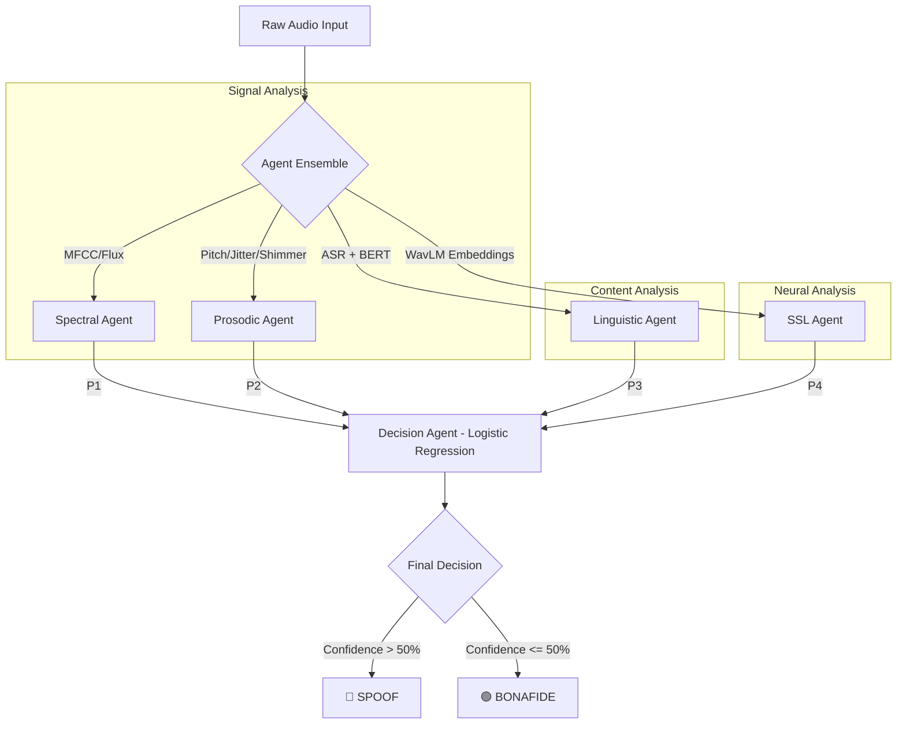

# 🛡️ Multi-Agent Deepfake Speech Detection System (MAD-SDS)

[](https://www.python.org/downloads/)
[](https://xgboost.readthedocs.io/)
[](https://huggingface.co/docs/transformers/index)

## 1. 📊 About the Dataset
This system is trained and evaluated on the **ASVspoof 5 (2024/2025) Challenge Dataset**. 
*   **Volume:** Contains thousands of speakers and over 30+ different types of spoofing attacks (TTS, Voice Conversion, and Adversarial).
*   **The Challenge:** Deepfake generators have become so advanced that spectral features alone are no longer enough. The dataset is intentionally "Spoof-Heavy," leading to a significant **Class Imbalance** that requires specialized handling.

---

## 2. 🏛️ High-Level Architecture
MAD-SDS operates on a **Federated Agent Logic**. Instead of a single decision-maker, the system queries four specialized "experts" (agents) and fuses their confidence scores through a final **Logistic Regression Meta-Classifier**.

---

## 3. 🧠 The Multi-Agent Ensemble

### A. Spectral Agent (The "Texture" Detector)
*   **Model:** XGBoost (Extreme Gradient Boosting).
*   **Why?** Spectral artifacts are often sharp and localized. XGBoost's decision trees excel at finding these "boundary" glitches in frequency data.
*   **Features:**
    *   **MFCCs (Mel-Frequency Cepstral Coefficients):** Captures the "shape" of the vocal tract. AI often fails to model the subtle transitions between phonemes.
    *   **Spectral Flux:** Measures how quickly the power spectrum changes. AI audio often has "unnatural" jumps in frequency.
    *   **Spectral Centroid:** The "center of mass" of the sound. AI speech can be "too bright" or "too dull" compared to humans.

### B. Prosodic Agent (The "Naturalness" Detector)
*   **Model:** XGBoost.
*   **Why?** Prosody (rhythm, stress, and intonation) is the "soul" of speech. AI often sounds "robotic" because it can't perfectly replicate human vocal-fold micro-vibrations.
*   **Features:**
    *   **Pitch (F0):** The fundamental frequency. AI often has "perfectly flat" pitch that humans can't maintain.
    *   **Jitter:** Micro-variations in the *timing* of pitch periods. Low jitter = "Too perfect" = Fake.
    *   **Shimmer:** Micro-variations in the *amplitude* of pitch periods. AI often lacks the natural volume fluctuations of human breath.
    *   **HNR (Harmonics-to-Noise Ratio):** Measures the clarity of the voice. Higher noise ratios often indicate synthesis artifacts.

### C. Linguistic Agent (The "Context" Detector)
*   **Model:** OpenAI Whisper (ASR) + Fine-tuned BERT.
*   **Why?** Many TTS models generate sentences that are grammatically perfect but contextually weird or use "AI-typical" word choices.
*   **Process:** We transcribe audio to text via **Whisper-Tiny** and then pass the text through **BERT** to find semantic deepfake signatures.

---

## ⚖️ Class Imbalance & SMOTE
The dataset is skewed: ~80% of samples are Spoof, and ~20% are Bonafide. 
*   **The Problem:** Without correction, models will simply "guess spoof" for every file to achieve high accuracy, while failing to actually recognize a real human.
*   **The Solution (SMOTE):** We use **Synthetic Minority Over-sampling Technique** to create "synthetic" Bonafide samples in the feature space. This forces the XGBoost agents to learn the *boundaries* of real speech rather than just memorizing the spoof majority.

---

## 🔄 Training Workflow
1.  **Extraction:** Raw audio is resampled to 16kHz and sent to the 3 extraction pipelines (Spectral, Prosodic, SSL).
2.  **Balancing:** SMOTE is applied to the extracted feature vectors for Spectral and Prosodic models.
3.  **Base Training:** 
    *   Spectral & Prosodic XGBoost models are trained via **Hyper-parameter Optimization**.
    *   Linguistic BERT is fine-tuned on the transcripts.
4.  **Meta-Fusion:** All 4 models run inference on a "Hold-out" set. Their probability outputs are used to train the **Logistic Regression Meta-Classifier** (Decision Agent).

---

## 🛡️ SSL Model & Robustness
*   **Model:** WavLM (Base-Pruned).
*   **Role:** The SSL (Self-Supervised Learning) model acts as our **"Neural Safety Net."**
*   **Robustness:** Because WavLM was pre-trained on 94,000 hours of diverse human speech, it has an internal "understanding" of what human speech should sound like. It is extremely robust to **Unseen Generators**—it can detect a deepfake from a new AI model even if it has never seen that specific AI before.

---

## 📊 Final Evaluation Results

### 1. Spectral Agent Results
| Metric | Value |
| :--- | :--- |
| **EER** | 37.60% |
| **AUC** | 0.6793 |
| **Accuracy** | 58.25% |
| **F1 Score** | 0.6800 |

### 2. Prosodic Agent Results
| Metric | Value |
| :--- | :--- |
| **EER** | 42.83% |
| **AUC** | 0.6164 |
| **Accuracy** | 57.60% |
| **F1 Score** | 0.6855 |

### 3. Linguistic Agent Results
| Class | Precision | Recall | F1-Score |
| :--- | :--- | :--- | :--- |
| **Bonafide** | 0.37 | 0.67 | 0.47 |
| **Spoof** | 0.95 | 0.84 | 0.89 |
| **Average** | **0.88** | **0.82** | **0.84** |

---

## 🔄 End-to-End Workflow Pipeline



---

## 🚀 How to Run
```bash
python main.py path/to/your/audio.flac
```